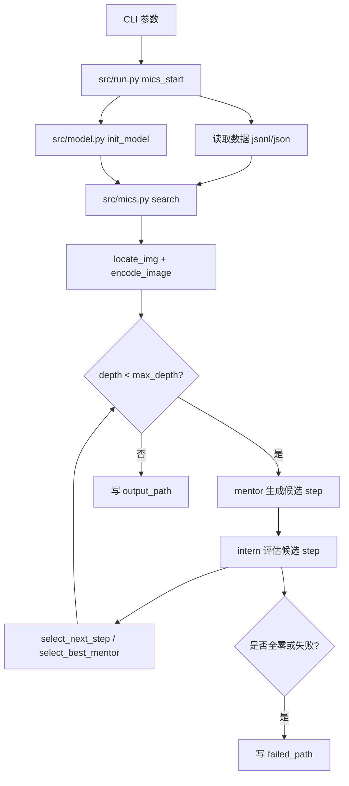
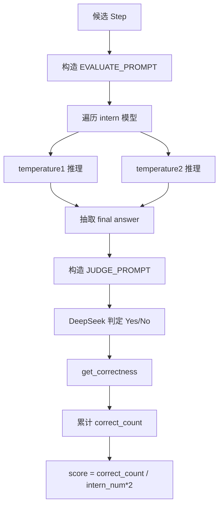
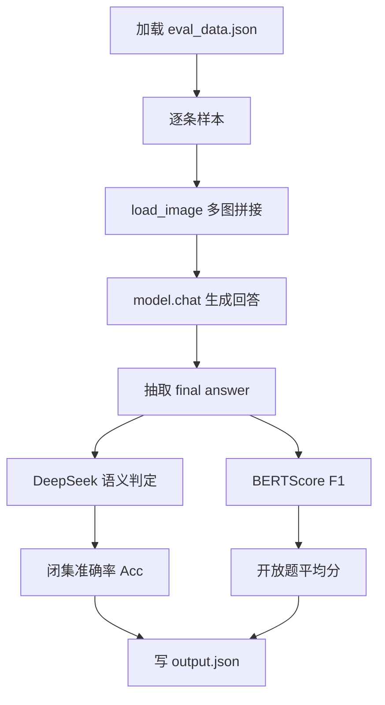

# Chiron-o1 代码导读（Code Guide）

这份文档帮你快速理解这个仓库的目标、代码结构、执行流程，以及你该从哪里改起。

## 1. 项目在做什么

这个仓库实现的是 `Mentor-Intern Collaborative Search (MICS)`：

- 多个 `mentor` 模型生成“下一步推理”
- 多个 `intern` 模型对每个候选步骤做验证打分
- 通过评分选择下一步，迭代形成最终推理链

核心入口是 `src/run.py` + `src/mics.py`。

## 2. 仓库结构速览

- `src/run.py`: 主程序入口，参数解析、数据加载、模型初始化、逐样本搜索
- `src/mics.py`: 搜索主逻辑（生成步骤、intern 评估、选择路径、写结果）
- `src/model.py`: 本地 intern 模型加载（Qwen2.5-VL、Qwen2-VL、InternVL3）
- `src/utils.py`: 图片定位/编码、API forward、文本处理、步骤选择策略
- `src/step.py`: 推理树节点结构 `Step`
- `src/prompt.py`: 三类核心 prompt（生成、评估、裁判）
- `src/qwenvl_forward.py`: Qwen-VL 本地推理封装
- `src/internvl_forward.py`: InternVL 本地推理封装（含多图 patch 拼接）
- `eval/eval.py`: 离线评测脚本（DeepSeek 判分 + BERTScore）
- `infer.py`: 单模型推理示例（非 MICS 搜索流程）
- `src/demo_data/demo.jsonl`: demo 数据格式示例
- `train/*.sh`: 基于 InternVL 训练脚本模板

## 3. 推荐阅读顺序

建议按下面顺序读，最省时间：

1. `src/run.py`
2. `src/mics.py`
3. `src/step.py`
4. `src/utils.py`
5. `src/model.py`
6. `src/prompt.py`
7. `src/qwenvl_forward.py` + `src/internvl_forward.py`
8. `eval/eval.py`

## 4. 一次运行到底发生了什么

### 4.1 入口与参数

`src/run.py` 负责：

- 读取输入数据（json/jsonl）
- 按 `num_chunks/chunk_idx` 分片
- 调用 `init_model(args)` 加载本地 intern 模型
- 创建 `MentorInternSearch(args)`
- 对每个样本执行 `search(...)`

输出：

- 成功结果写入 `output_path`（jsonl）
- 失败样本写入 `output_path` 对应的 `_failed.jsonl`

### 4.2 搜索主循环（最关键）

`src/mics.py` 中 `MentorInternSearch.search()` 的主流程：

1. 从样本中取 `question`、`gt_answer`、`images`、病例信息
2. 初始化 root step：`Let's think...`
3. 对每个深度（`max_depth`）：
   - 每个 mentor 生成候选下一步
   - 对每个候选，所有 intern 用两种温度分别回答
   - 用 evaluator（默认 `deepseek-chat`）判定回答对错，得到分数
   - 若有满分步骤（score=1.0）可提前结束
   - 否则选分数最高步骤继续下一层
4. 达到最大深度或提前终止后写结果

### 4.3 评分机制

在 `_evaluate_step_with_interns()`：

- 每个 intern 跑两次：`temperature1` + `temperature2`
- 总评次数 = `intern模型数 * 2`
- `score = 正确次数 / 总评次数`

`get_correctness()` 目前是“包含 yes 则正确”，这是一个可改进点（见第 8 节）。

### 4.4 逻辑链条（从输入到输出）

主流程链条：

`CLI参数`  
-> `src/run.py::mics_start`  
-> `读数据(read_jsonl/json.load)`  
-> `src/model.py::init_model`（加载本地 intern 模型）  
-> `src/mics.py::MentorInternSearch.search`（逐样本）  
-> `src/utils.py::locate_img + encode_image`（找图+编码）  
-> `for depth in max_depth`（每层搜索）  
-> `mentor生成候选step`（`_generate_next_step_with_mentor`）  
-> `intern打分`（`_evaluate_step_with_interns`）  
-> `select_next_step/select_best_mentor`（选路径）  
-> `写入 output_path 或 failed_path`

单步评分链条（一个候选 step 如何得分）：

`候选 step`  
-> `构造 EVALUATE_PROMPT`  
-> `每个 intern 跑 temperature1 + temperature2`  
-> `抽取 "### The final answer is:"`  
-> `构造 JUDGE_PROMPT`  
-> `ds_forward(deepseek-chat)`  
-> `get_correctness(Yes/No)`  
-> `score = correct_count / (intern_num * 2)`

评测脚本链条（`eval/eval.py`）：

`加载 eval_data.json`  
-> `load_image`（多图拼接 patch）  
-> `model.chat` 得到预测  
-> `DeepSeek 判对错`（闭集 Acc）  
-> `BERTScore`（开放题语义分）  
-> `写 output.json + 最终指标`

### 4.5 图表版逻辑链条（Mermaid）

主流程图：



单步评分图（一个候选 step 的得分路径）：



评测流程图（`eval/eval.py`）：



## 5. 数据格式（你改数据时最常看）

参考 `src/demo_data/demo.jsonl`，单条样本关键字段：

- `rid`: 样本 ID
- `messages[0].content`: 用户问题（含 `**Question:**` 前缀）
- `messages[1].content`: 标准答案（含 `**Correct Answer:**` 前缀）
- `images`: 图像相对路径列表
- `presentation` / `age_label` / `gender_label` / `caption`: 病例补充信息

图片查找在 `src/utils.py::locate_img()`：

- 先拼接 `args.image_dir_path + image`
- 不存在再尝试把 `image` 当绝对/当前路径

## 6. 模型调用路由（非常实用）

`src/mics.py::_call_model_forward()` 根据名字分发：

- 包含 `gpt` -> `gpt_forward`（OpenAI 兼容接口）
- 包含 `gemini` -> `gpt_forward`（也是兼容 chat.completions）
- 包含 `72` -> `qwenplus_forward`（远程 Qwen72B）
- 包含 `qwen` -> 本地 `qwenvl_forward`
- 包含 `internvl` -> 本地 `internvl_forward`

所以“模型名字符串”本身决定了分支逻辑，改名字时要注意匹配规则。

## 7. 你最可能会改的地方

### 7.1 改搜索策略

- 深度和温度：`src/run.py` 参数 `max_depth`, `temperature1`, `temperature2`
- 路径选择：`src/utils.py::select_next_step`
- mentor 竞争策略：`src/utils.py::select_best_mentor`

### 7.2 改 prompt

- 生成 prompt：`src/prompt.py::REASONING_PROMPT`
- intern 评估 prompt：`src/prompt.py::EVALUATE_PROMPT`
- 裁判 prompt：`src/prompt.py::JUDGE_PROMPT`

### 7.3 接入新模型

通常需要改 3 处：

1. `src/model.py` 中加载模型并放进 `model_set`
2. `src/mics.py::_call_model_forward()` 增加分发分支
3. `src/run.py` 的 CLI 参数和校验逻辑

## 8. 代码风险与调试建议

### 8.1 当前实现里要注意的点

- `src/utils.py::get_correctness()` 只要出现 `yes` 就判正确，容易误判（比如包含否定上下文）
- `src/utils.py::locate_img()` 报错信息用了 `d['image']`，但数据里字段是 `images`
- `src/model.py::split_model()` 假设有 CUDA 多卡；在 CPU/MPS 环境会不兼容
- `src/internvl_forward.py` 使用 `.cuda()`，对非 CUDA 机器不可用

### 8.2 最小化排错路径

1. 先用 `src/demo_data/demo.jsonl` 跑 1 条样本
2. 把 `mentor_models` 和 `intern_models` 各减到最小组合
3. 先确认图片路径能被 `locate_img()` 找到
4. 再看 API key/base_url 是否连通

## 9. 常用命令模板

### 9.1 跑 MICS 搜索（示例）

```bash
python ./src/run.py \
  --data_path './src/demo_data/demo.jsonl' \
  --image_dir_path './src/demo_data/images' \
  --output_path './src/demo_data/test/result.jsonl' \
  --qwen25_vl_7b_model_path 'Qwen/Qwen2.5-VL-7B-Instruct' \
  --qwen2_vl_7b_model_path 'Qwen/Qwen2-VL-7B-Instruct' \
  --internvl3_8b_model_path 'OpenGVLab/InternVL3-8B' \
  --openai_api_key 'sk-xxx' \
  --openai_base_url 'https://xxx' \
  --qwen_api_key 'sk-xxx' \
  --qwen_base_url 'https://xxx' \
  --gemini_api_key 'sk-xxx' \
  --gemini_base_url 'https://xxx' \
  --ds_api_key 'sk-xxx' \
  --ds_base_url 'https://api.deepseek.com' \
  --mentor_models chatgpt-4o-latest google/gemini-2.5-pro-preview-03-25 qwen2.5-vl-72b-instruct \
  --intern_models qwen25_vl_7b qwen2_vl_7b internvl3_8b
```

### 9.2 跑评测

```bash
python ./eval/eval.py \
  --vqa_json_path './eval/eval_data.json' \
  --image_dir './eval' \
  --model_path 'manglu3935/Chiron-o1-8B' \
  --output_path './eval/output.json' \
  --api_key 'sk-xxx'
```

## 10. 一句话总结

把它当成“多导师提步骤 + 多实习生验证步骤 + 裁判模型给分”的树搜索系统；读懂 `run.py -> mics.py`，你就掌握了项目 80% 的核心。
