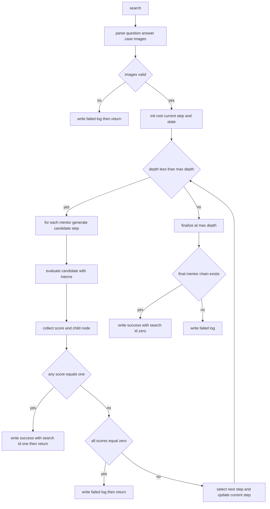

# `src/mics.py` 逻辑导读（含树状图）

这份文档的目标：让你在读 `src/mics.py` 时，不被细节淹没，先抓住“单样本怎么从输入走到输出”。

## 1. 这个文件在整个项目里的职责

`src/mics.py` 负责单样本的核心搜索循环：

- mentor 生成候选推理 step
- intern 对候选 step 打分
- 根据分数决定是否提前成功、提前失败，或继续下一层
- 把结果写入成功/失败日志（由 `run.py` 传进来的文件句柄）

核心类：`MentorInternSearch`（`src/mics.py:14`）

核心函数：

- `_call_model_forward`（`src/mics.py:42`）
- `_generate_next_step_with_mentor`（`src/mics.py:85`）
- `_evaluate_step_with_interns`（`src/mics.py:136`）
- `search`（`src/mics.py:235`）

## 2. 单样本端到端时序（你最该先记住的）

对应 `search(...)`（`src/mics.py:235`）

1. 解析输入
- 从 `data` 取 `question`、`gt_answer`、`case_info`（`src/mics.py:248`, `src/mics.py:251`, `src/mics.py:253`）
- 解析并编码图片（`src/mics.py:256`-`src/mics.py:259`）
- 图片失败直接记失败并返回（`src/mics.py:260`-`src/mics.py:273`）

### 2.1 `src/demo_data/demo.jsonl` 字段如何对应到 `mics.py`

`demo.jsonl` 每一行是一个样本，`search(data, ...)` 的 `data` 就是这一行反序列化后的字典。

| demo 字段 | 在 `mics.py` 的用法 | 变量/去向 |
|---|---|---|
| `messages[0].content` | 取问题文本，去掉 `**Question:**` | `question`（`src/mics.py` 里用于 mentor 与 intern prompt） |
| `messages[1].content` | 取标准答案，去掉 `**Correct Answer:**` | `gt_answer`（用于 evaluator 判定正确性） |
| `images` | 先通过 `locate_img(...)` 定位真实路径，再 `encode_image(...)` | `img_paths`（本地模型）与 `base64_images`（远程 API 模型） |
| `presentation` | `process_case_info(data)` 拼装病例信息 | `case_info` |
| `age_label` | 同上 | `case_info` |
| `gender_label` | 同上 | `case_info` |
| `caption` | 同上（含 `<image>` 占位符） | `case_info`，后续可能被 `replace_image_references(...)` 改写 |
| `rid` | 仅用于日志与结果标识 | 写入 `result_data['rid']` / 控制台打印 |

补充：
- `demo.jsonl` 里 `images` 是列表（可能一张也可能多张），代码按多图流程处理。
- `demo.jsonl` 里没有 `answer_type`，`mics.py` 不依赖这个字段，所以不会出问题。

### 2.2 单条 demo 样本的变量快照（`depth=0/1`）

下面用“示意值”展示变量流。真实值取决于当次模型输出与打分。

#### 进入 `search(...)` 后（循环前）

```python
rid = "169992"
question = "Given this 45-year-old male patient ..."
gt_answer = "Anomalous interarterial course of the left coronary artery ..."
img_paths = [".../169992/ct_group1/0.png"]
base64_images = ["iVBORw0KGgoAAA..."]  # ignore
case_info = "Chief complaint: ...\nAge: 45 years\nGender: Male\nImage analysis: ..."

current_step.text = "Let's think about how to solve this problem clearly and reasonably step by step."
mentors_scores = {
    "mentorA": [],
    "mentorB": [],
    "mentorC": []
}
reasoning_chains = {}
previous_mentors = []
```

#### `depth=0`（每个 mentor 生成并评分）

每个 mentor 处理后，都会得到一组 `new_step + score`，并写入状态。

```python
# 示例：mentorA
prefix_reasoning = current_step.get_full_reasoning()
suffix_reasoning = "### Step 1: ...\n### Step 2: ...\n### The final answer is: ..."
complete_reasoning = prefix_reasoning + "\n" + suffix_reasoning
reasoning_chains["mentorA"] = complete_reasoning
new_step_A = "### Step 1: ...\n### Step 2: ..."
score_A = 0.67
mentors_scores["mentorA"].append(0.67)

# mentorB, mentorC 同理
score_B = 0.67
score_C = 0.33
generated_children_for_step = [
    Step(score=0.67, generated_by="mentorA", parent=current_step),
    Step(score=0.67, generated_by="mentorB", parent=current_step),
    Step(score=0.33, generated_by="mentorC", parent=current_step),
]
```

本层决策（未出现 1.0 且非全 0）：

```python
current_step = select_next_step(generated_children_for_step, previous_mentors)
# 假设选中 mentorB（和 mentorA 平分时，可能随机/按未选过优先）
previous_mentors.append("mentorB")
```

#### `depth=1`（基于选中的前缀继续）

现在每个 mentor 再生成时，`reasoning_prefix` 已经是 `depth=0` 选中节点的完整链：

```python
reasoning_prefix = current_step.get_full_reasoning()
# 这时的 prefix 包含 root + depth0 被选中的 new_step
```

状态可能变成：

```python
mentors_scores = {
    "mentorA": [0.67, 1.00],
    "mentorB": [0.67, 0.67],
    "mentorC": [0.33, 0.33]
}
previous_mentors = ["mentorB", "mentorA"]  # 假设 depth1 选中 mentorA
```

如果 `depth=1` 某 mentor 达到 `score==1.0`，会提前成功写结果并返回；否则继续下一层直到 `max_depth` 或失败条件触发。

## 10. JSON 结构总览（逐个解析 + 为什么这样设计）

这一节把流程里会碰到的 JSON/JSONL 都列出来，便于你排查数据问题。

### 10.1 输入样本：`demo.jsonl`（以及 `run.py --data_path` 的同类文件）

格式：JSONL（每行一个对象）。

单条结构（简化）：

```json
{
  "rid": "169992",
  "messages": [
    {"role": "user", "content": "**Question:** ..."},
    {"role": "assistant", "content": "**Correct Answer:** ..."}
  ],
  "images": ["169992/ct_group1/0.png"],
  "title": "...",
  "certainty": "...",
  "presentation": "...",
  "age_label": "45 years",
  "gender_label": "Male",
  "caption": ["According to the <image> ..."]
}
```

字段意义：
- `rid`: 样本唯一标识，用于日志、追踪、失败重跑。
- `messages`: 复用对话式格式，`mics.py` 固定取第 0 条当问题、第 1 条当标准答案。
- `images`: 支持多图病例（CT 组图/X-ray 多视角）。
- `presentation/age_label/gender_label/caption`: 组成 `case_info`，给 mentor 提供结构化上下文。

为什么这样设计：
- 用 `messages` 而不是单独 `question/answer`，可以兼容 chat 模型数据生态，后续扩展多轮对话也方便。
- `images` 统一为列表，避免单图/多图分支代码。
- 病例元信息拆字段而非大段文本，便于清洗、替换、重排（例如 `<image>` 到 `Image 1` 的映射）。

### 10.2 搜索成功输出：`--output_path`（JSONL）

来源：`mics.py` 里 `result_data` 写入 `search_file`。

单条结构（简化）：

```json
{
  "rid": "169992",
  "images": ["169992/ct_group1/0.png"],
  "question": "...",
  "gt_answer": "...",
  "reasoning": "### Step 1: ... ### The final answer is: ...",
  "scores": {
    "mentorA": [0.67, 1.0],
    "mentorB": [0.33, 0.67]
  },
  "final_depth": "2",
  "generated_by": ["mentorB", "mentorA"],
  "search_id": "1"
}
```

字段意义：
- `reasoning`: 最终选定 mentor 的完整推理链。
- `scores`: 每个 mentor 在各层的评分轨迹，便于复盘“为什么选它”。
- `generated_by`: 最终路径上每层被选中的 mentor 序列。
- `search_id`:
  - `"1"`: 早停成功（某层出现满分 1.0）
  - `"0"`: 到 `max_depth` 正常收尾（未触发满分早停）

为什么这样设计：
- 输出为 JSONL，适合长任务边跑边写；即使中途挂掉，也保留已完成样本。
- 保留 `scores + generated_by`，让搜索决策可解释，而不只是“最终答案”黑盒。

### 10.3 搜索失败输出：`*_failed.jsonl`

来源：`mics.py` 和 `run.py` 的异常/失败分支。

常见结构：

```json
{
  "rid": "169992",
  "...原始样本字段...": "...",
  "error": "All mentor scores are zero."
}
```

或（运行级错误）：

```json
{
  "error": "Model initialization failed",
  "details": "..."
}
```

为什么这样设计：
- 失败日志和成功结果分离，方便统计失败原因并做重试队列。
- 失败时尽量保留原样本字段，方便定位是数据问题（图像丢失/格式异常）还是模型问题。

### 10.4 评测输出：`eval.py --output_path`（JSON 数组，不是 JSONL）

`eval/eval.py` 采用“一个 JSON 数组文件”，每条样本 append 一个对象，最后再 append 总结指标对象。

单条样本结构（简化）：

```json
{
  "index": "169992",
  "image_name": ["169992/ct_group1/0.png"],
  "question": "...",
  "reason_answer": "### Step 1: ...",
  "model_answer": "...",
  "ground_truth": "...",
  "answer_type": "...",
  "result": [closed_correct, closed_total, open_bertscore_sum, open_count]
}
```

末尾汇总结构：

```json
{
  "CLOSED Questions Acc": 0.73,
  "OPEN   Questions BERTScore-F1": 0.81
}
```

为什么这样设计：
- `eval.py` 更偏离线评测脚本，数据量通常可控，用单个 JSON 数组查看更直观。
- 每条记录里带累计计数 `result`，便于中途查看进度曲线，而不用等跑完再算。

### 10.5 一句话对比：为什么训练/搜索用 JSONL，评测脚本常用 JSON

- JSONL：流式、容错强、适合长时间搜索任务。
- JSON 数组：结构完整、人工查看方便、适合离线汇总分析。

2. 初始化搜索状态
- root 文本设为固定起始句（`src/mics.py:281`-`src/mics.py:283`）
- `current_step` 指向 root（`src/mics.py:283`）‘
- mentors_scores 记录每一个mentor在各层的得分历史，用于后续tie-break (select_best_mentor和结果输出里面的score字段)
- reasoning_chains 缓存每一个mentor最新的完整推理串，作用是复用已有的生成，避免重复调用mentor （同一个mentor连续被选的时候很有用）
- previous_mentors 记录最终路径每层是哪一个mentor被选中，用于tie-break，优先选择没有选过的 mentor
- 初始化 `mentors_scores`、`reasoning_chains`、`previous_mentors`（`src/mics.py:285`-`src/mics.py:290`）

3. 逐深度搜索（for depth）
- 遍历每个 mentor 生成一个候选 step（`src/mics.py:309` 起）
- 对候选 step 调 intern 评估，得到 score（`src/mics.py:343`-`src/mics.py:347`）
- 记录到候选列表，等待本层决策（`src/mics.py:351`-`src/mics.py:355`）

4. 本层决策
- 若任意 mentor score==1.0：提前成功，写成功日志并 return（`src/mics.py:362`-`src/mics.py:386`）
- 若本层全是 0 分：提前失败，写失败日志并 return（`src/mics.py:388`-`src/mics.py:395`）
- 否则选一个 best child 作为新的 `current_step`，进入下一层（`src/mics.py:397`-`src/mics.py:404`）

5. 到最大深度后的收尾
- 没提前终止则写最终结果（`src/mics.py:408`-`src/mics.py:439`）
- 若无有效路径则写失败（`src/mics.py:440`-`src/mics.py:445`）

## 3. 树状图：推理树是怎么长出来的

### 3.1 ASCII 树（概念图）

```text
root: "Let's think ..."
└── depth 0 candidates (one per mentor)
    ├── mentor A -> step_A0 (score=...)
    ├── mentor B -> step_B0 (score=...)
    └── mentor C -> step_C0 (score=...)

select_next_step(...) picks one node as current_step

current_step
└── depth 1 candidates (again one per mentor)
    ├── mentor A -> step_A1 (score=...)
    ├── mentor B -> step_B1 (score=...)
    └── mentor C -> step_C1 (score=...)

... until:
- score==1.0 => early success
- all zero => early failure
- reach max_depth => final write
```

注意：代码会把每个 mentor 的候选都挂成 child，但每层只选择一个 `current_step` 继续向下（近似 beam size = 1）。

### 3.2 Mermaid 流程树（执行视角）



## 4. mentor 生成子流程

对应 `_generate_next_step_with_mentor(...)`（`src/mics.py:85`）

1. 取当前路径前缀：`reasoning_prefix = step.get_full_reasoning()`（`src/mics.py:93`）
2. 拼 `REASONING_PROMPT`（`src/mics.py:99`-`src/mics.py:114`）
3. 调统一路由 `_call_model_forward(...)`（`src/mics.py:120`）
4. 返回 `(reasoning_prefix, response)`（`src/mics.py:130`-`src/mics.py:131`）

路由规则看 `_call_model_forward`（`src/mics.py:42`）：

- `'gpt'` -> `gpt_forward`
- `'gemini'` -> `gpt_forward`（不同 client）
- `'72'` -> `qwenplus_forward`
- `'qwen'` -> 本地 `qwenvl_forward`
- `'internvl'` -> 本地 `internvl_forward`

## 5. intern 打分子流程

对应 `_evaluate_step_with_interns(...)`（`src/mics.py:136`）

打分公式：

```text
total_evaluations = intern_model_count * 2
score = correct_count / total_evaluations
```

为什么乘 2：每个 intern 用两种温度跑两次（`temperature1`, `temperature2`，`src/mics.py:181`）。

单次评估链路：

1. intern 生成回答（`src/mics.py:185`-`src/mics.py:190`）
2. 解析 `### The final answer is:`（`src/mics.py:197`-`src/mics.py:205`）
3. evaluator（DeepSeek）判 Yes/No（`src/mics.py:210`-`src/mics.py:223`）
4. Yes 则 `correct_count += 1`（`src/mics.py:221`-`src/mics.py:222`）

## 6. 关键状态变量（读代码时盯住这几个）

在 `search(...)` 中：

- `current_step`：当前活跃路径节点（下一层从这里扩展）
- `generated_children_for_step`：本层所有候选
- `mentors_scores`：每个 mentor 的层级得分历史
- `reasoning_chains`：每个 mentor 当前完整推理串缓存
- `previous_mentors`：最终路径上已选 mentor 序列
- `full_score_mentors`：本层达到 1.0 的 mentor
- `all_zero_score`：本层是否全 0，用于提前失败

## 7. 提前终止规则（必须背下来）

成功提前终止：
- 条件：本层出现 `score == 1.0`
- 行为：立刻写成功日志，`search_id='1'`，并返回（`src/mics.py:362`-`src/mics.py:386`）

失败提前终止：
- 条件：本层所有 mentor 分数都是 0
- 行为：写失败日志并返回（`src/mics.py:388`-`src/mics.py:395`）

正常收尾：
- 条件：到 `max_depth` 仍未提前终止
- 行为：写成功日志 `search_id='0'`，或写失败（`src/mics.py:408`-`src/mics.py:445`）

## 8. 你现在可以这样验证自己是否理解

读完后你应能口述：

1. 一条样本从 `search` 进入后，先做哪三件准备？
2. 一层里 mentor 和 intern 的调用顺序是什么？
3. `score==1.0`、`all_zero_score`、`max_depth` 分别触发什么结果？
4. `current_step` 为什么每层只会更新成一个节点？

如果你愿意，下一步可以把这份文档和 `src/step.py` 结合，我再给你一版“Step 对象字段如何支撑整棵树”的补充图。

## 9. Demo：拿 `demo.jsonl` 一条样本手动跑一遍

这里用 `src/demo_data/demo.jsonl` 第 1 条（`rid=169992`）举例，目的是理解变量如何流动。  
注意：下面的 mentor/intern 文本是“示意”，不是你本地真实模型输出。

样本关键信息：

- `rid`: `169992`
- `question`: 45 岁男性，夹层样胸痛，CT 见左冠异常走行，问最可能解释
- `gt_answer`: `Anomalous interarterial course ... with potential myocardial ischemia.`
- `images`: `169992/ct_group1/0.png`

### 9.1 进入 `search(...)` 后的初始化

1. 解析问题/答案/病例信息并编码图片（`src/mics.py:248`-`src/mics.py:259`）
2. 设定：
- `current_step = root`
- `root.text = "Let's think ... step by step."`
- `mentors_scores = {mentorA: [], mentorB: [], mentorC: []}`
- `reasoning_chains = {}`
- `previous_mentors = []`

### 9.2 depth=0：每个 mentor 生成候选 step 并打分

假设 mentor 列表是：

- `chatgpt-4o-latest`
- `google/gemini-...`
- `qwen2.5-vl-72b-instruct`

对每个 mentor，代码会：

1. 调 `_generate_next_step_with_mentor(...)`
2. 返回 `(prefix_reasoning, suffix_reasoning)`
3. 首层用 `extract_first_two_steps(suffix_reasoning)` 得到 `new_step`
4. 构造 `temp_step = Step(prefix=current_step.text, step_text=new_step, ...)`
5. 调 `_evaluate_step_with_interns(temp_step, ...)` 得到 `score`

示意结果：

- mentorA `new_step`：先排除主动脉夹层，再指向冠脉异常缺血机制 -> `score=1.0`
- mentorB `new_step`：描述解剖但缺少症状机制 -> `score=0.67`
- mentorC `new_step`：回答偏泛化 -> `score=0.33`

于是：

- `mentors_scores` 变成：`{A:[1.0], B:[0.67], C:[0.33]}`
- `full_score_mentors = [A]`

### 9.3 depth=0 直接提前成功

因为出现 `score==1.0`（`src/mics.py:362` 起）：

1. 选 `best_mentor`（这里只有 A）
2. 取 `full_reasoning = reasoning_chains[A]`
3. 写 `search_file` 一条结果：
- `rid=169992`
- `reasoning=full_reasoning`
- `scores={A:[1.0], B:[0.67], C:[0.33]}`
- `final_depth='1'`
- `search_id='1'`（表示提前成功）
4. `return`，该样本结束

### 9.4 这条样本对应的“树”长什么样

```text
root
└── depth 0
    ├── mentorA step (score=1.0)  <- selected, early success
    ├── mentorB step (score=0.67)
    └── mentorC step (score=0.33)
```

因为 depth=0 就满分了，所以不会进入 depth=1。

### 9.5 如果 depth=0 没人满分会怎样

分两种：

1. 有非零分  
- 例如 `A=0.67, B=0.67, C=0.33`
- 用 `select_next_step(...)` 选一个 child 作为新 `current_step`
- 继续 depth=1

2. 全 0 分  
- `all_zero_score=True` 到层末仍不变
- 写 `failed_search_file` 并返回（`error = "All mentor scores are zero."`）

这个分叉就是 `search(...)` 的核心控制逻辑。
